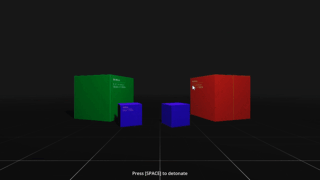
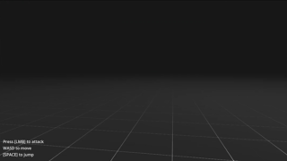

<h1 align="center">
  <br>
  
  <br>
  Dwarf Impulse
  <br>
</h1>

<h4 align="center">An easy to use camera shake plugin for Godot.</h4>

<strong>Note:</strong> this plugin is C# only.





<h3>Features:</h3>

* Easy to use API
* Predefined shake algorithms
* Easily extensible
* Supports both 2D and 3D

## Getting Started
1. [Installation](#installation)
2. [Usage](#usage)
    * [Setup](#setup)
    * [Basic Usage](#basic-usage)
    * [Demos](#demos)
    * [Writing Custom Presets](#writing-custom-presets)
3. [Time Envelope](#time-envelope)
4. [Spatial Attenuation](#spatial-attenuation)

## Installation
clone this repo: <br>
```
git clone https://github.com/Hyrdaboo/DwarfImpulse
```
or you can also download zip by clicking **Code**>**Download ZIP**

## Usage
### Setup
* After completing the installation, navigate to the downloaded files, and you will find the _addons_ folder.
* Drag and drop this folder into the root directory of your project.
* If your project already has an _addons_ folder, simply merge the contents of the _addons_ folder from the downloaded project with your existing _addons_ folder.
### Basic Usage

The most basic form of camera shake is done using Noise. There's a built-in preset ```NoiseShake``` that handles noise based camera shake. 

Usage example:
```C#
using Godot;
using DwarfImpulse;

public partial class ShakeController : Camera3D
{
    [Export] private ShakeDirector3D shakeDirector;
    [Export] private FastNoiseLite noise;

    public override void _Process(double delta)
    {
        if (Input.IsActionJustPressed("ui_accept"))
        {
            shakeDirector.Shake(NoiseShake.CreateWithNoise(noise)
                .WithDuration(3.0f)
                .WithEulersAmount(new Vector3(0.05f, 0, 0.03f)));
        }
    }
}
```

> [!WARNING]
> Placing ShakeDirector in Autoload is advised against but if you need to do so use the ```ShakeDirector(bool isGlobal)``` constructor
> and set it to true. This will ensure the node always stays in the root scene.


* Add this script to a Node3D, and then initialize its parameters.


  
  
* Assign the camera as the target for ShakeDirector3D
* Press play and when you press space the camera shake should initiate

<strong>Note:</strong> You could also do these steps from code but this way it's more visual

Sometimes, when more precise shakes are required, `NoiseShake` may not be suitable. In such cases, you can use the `BounceShake` preset, and the usage is almost identical.

Example:
```C#
// start the shakeDirector with BounceShake this time and set a start direction vector along which the target will bounce
shakeDirector.Shake(new BounceShake()
    .WithDuration(0.3f)
    .WithStartDir(new Vector3(1, 1, 0))
    .WithFrequency(5.0f));
```

### Demos
There are a couple of demos you can take a look at and learn from.
* Inside the _addons_ folder navigate to _Samples_>_Scenes_. Here you will find the four available demos.
* Setup the input map for the demos:


### Writing Custom Presets
You can also define your own ShakePresets. Any class that inherits the abstract class ```ShakePreset``` can be used with ```ShakeDirector3D``` or ```ShakeDirector2D```

```C#
class MyCustomShake : ShakePreset
{

    public MyCustomShake WithDuration(float duration)
    {
        DurationLeft = duration;
        return this;
    }

    // this method is called every frame while the shake is active
    internal override Displacement ExecuteShake(float delta)
    {
        // return a new displacement with 0 positional offset and random rotation
        return new Displacement(Vector3.Zero, new Vector3(0.05f * (GD.Randf() * 2 - 1), 0, 0.03f * (GD.Randf() * 2 - 1)));
    }
}
```

Usage:
```C#
shakeDirector.Shake(new MyCustomShake().WithDuration(3.0f));
```

## Time Envelope
We don't want shakes to start and end abruptly. Time Envelope addresses this by controlling the strength of Shakes over time. You can take a look at the <a href="https://www.desmos.com/calculator/e9wxr78uu2">interactive demonstration</a> by <a href="https://github.com/gasgiant">gasgiant</a>

Example usage:
```C#
 var preset = NoiseShake.CreateWithNoise(noise)
        .WithOffsetAmount(new Vector3(25, 25, 0))
        .WithEnvelope(new Envelope(10, 1, 0.6f, Degree.Quadratic))
        .WithDuration(1.0f);
shakeDirector.Shake(preset);
```

## Spatial Attenuation
In cases where we need to have a camera shake originate from a 3D source we can make use of Spatial Attenuation. It controls the strength of shakes over distance relative to a shake source.  You can take a look at the <a href="https://www.desmos.com/calculator/iivcfrotk8">interactive demonstration</a> by <a href="https://github.com/gasgiant">gasgiant</a>

Example usage:
```C#
var preset = NoiseShake.CreateWithNoise(noise)
    .WithDuration(1.0f)
    .WithScrollSpeed(1000) //the speed at which the noisemap is scrolled (basically frequency)
    .WithEnvelope(new Envelope(10.0f, 2.0f, 0.35f, Degree.Quadratic))
    .WithEulersAmount(shakeRotationAmount)
    .WithOffsetAmount(shakeOffsetAmount);

preset.SpatialAttenuation.ShakeSourceMinDistance = minDistance; // min distance is where the strength of the shake is at max
preset.SpatialAttenuation.ShakeSourceMaxDistance = maxDistance; // shake strength reaches 0 at max distance
preset.SpatialAttenuation.ShakeSource = GlobalPosition; // the global position of the shake source in 3D world coordinates

shakeDirector.Shake(preset);
```

<i>This project was inspired by <a href="https://github.com/gasgiant/Camera-Shake">gasgiant</a></i>
